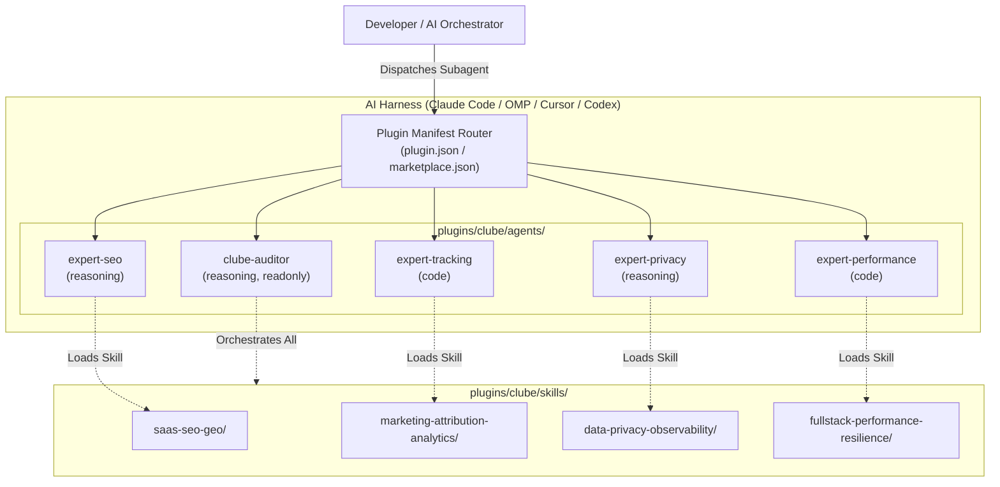
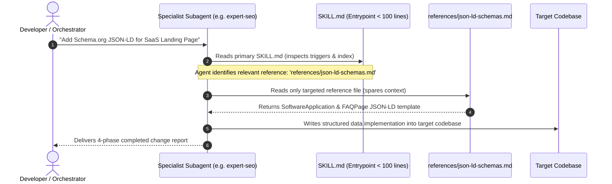
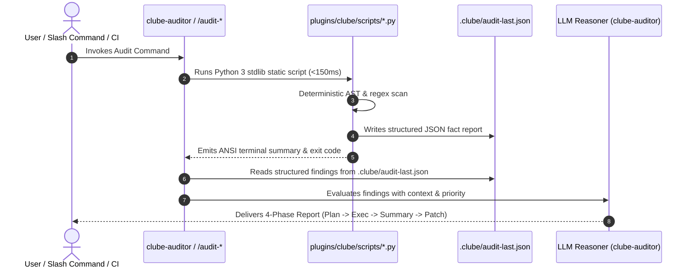
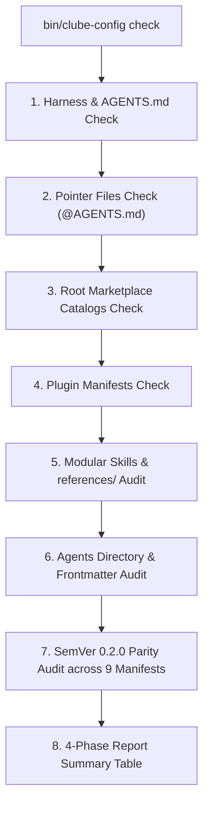

# Design - Clube Modular Architecture

## 1. Executive Summary

This document defines the architectural design for the **Clube Modular Architecture Restructuring (v0.2.0)**. It captures the foundational design decisions (D1–D3), system interaction topologies, agent frontmatter contracts, progressive disclosure mechanics, and automated verification architecture.

---

## 2. Architectural Decisions

### 2.1 Decision D1: Agent Capability Classes and Tool Allocation
- **Context:** AI harnesses (Oh My Pi, Claude Code, Cursor, Codex) require agent definitions in `plugins/clube/agents/`. We must decide how agent frontmatter specifies model assignments and tool access permissions.
- **Options Considered:**
  1. *Option 1 (Chosen):* Abstract Capability Classes (`reasoning`, `code`, `inherit`) with explicit standard tool allocations (`read`, `grep`, `glob`, `bash`, `write`).
  2. *Option 2:* Hardcoded Vendor Model Identifiers (e.g. `claude-3-5-sonnet-20241022`, `gpt-4o`).
- **Decision:** **Option 1 — Abstract Capability Classes.**
- **Rationale:**
  - **Portability:** Abstracts harness specifics, enabling agents to run on OMP (local/cloud models), Claude Code, Codex, and Cursor without breaking when model versions update.
  - **Principle of Least Privilege:** Read-only agents (`clube-auditor`) omit `write` tools, preventing unintended workspace modifications during audit reporting.
  - **Longevity:** Insulates the marketplace from proprietary model deprecation cycles.

---

### 2.2 Decision D2: Progressive Disclosure Skill Pattern (`references/`)
- **Context:** The 4 SaaS skills currently accumulate 200–350 lines of introductory principles, JSON-LD schemas, DDLs, regexes, and multi-framework snippets in a single `SKILL.md`. This induces LLM token bloat and degrades instruction following.
- **Options Considered:**
  1. *Option 1 (Chosen):* Progressive Disclosure — Lean `SKILL.md` (< 100 lines) with domain-specific `references/*.md` deep-dive guides.
  2. *Option 2:* Monolithic `SKILL.md` single file per domain.
- **Decision:** **Option 1 — Progressive Disclosure via `references/`.**
- **Rationale:**
  - **Context Economy:** AI agents load the top-level `SKILL.md` to determine applicability and only load specialized reference guides (e.g., `json-ld-schemas.md` or `server-side-capi.md`) when executing specific subtasks.
  - **Maintainability:** Individual reference guides can be updated, extended, or tested independently without modifying the core skill routing logic.
  - **Alignment:** Adheres to LoopTech and modern multi-agent modular architecture constitutions.

---

### 2.3 Decision D3: SemVer Release Strategy (Minor Bump 0.2.0)
- **Context:** The addition of 5 named specialist agents, skill decomposition into `references/`, and automated agent auditing in `bin/clube-config` represents a significant capability milestone.
- **Options Considered:**
  1. *Option 1 (Chosen):* Minor Version Bump to `0.2.0`.
  2. *Option 2:* Patch Version Bump to `0.1.1`.
  3. *Option 3:* Retain `0.1.0`.
- **Decision:** **Option 1 — Minor Version Bump to `0.2.0`.**
- **Rationale:**
  - **Semantic Versioning 2.0 Compliance:** Adding backward-compatible functional capabilities (named agents, modular references, validator extensions) strictly warrants a minor version bump (`0.1.0` -> `0.2.0`).
  - **Marketplace Visibility:** Signals to consumers and downstream agents that dedicated subagent delegation is now available.

---

## 3. Component Architecture & System Interactions

### 3.1 Multi-Harness Agent Dispatch & Delegation Flow



---

### 3.2 Progressive Disclosure Skill Loading Lifecycle



---

### 3.3 Two-Tier Hybrid Audit Interaction Flow



---

### 3.4 File System & Manifest Topology

```
clube-marketplace/
├── package.json                         [v0.2.0]
├── Makefile                             [check, audit, sync, init]
├── AGENTS.md                            [Canonical Instructions & Profile]
├── .claude-plugin/marketplace.json      [v0.2.0]
├── .omp-plugin/marketplace.json         [v0.2.0]
├── .cursor-plugin/marketplace.json      [v0.2.0]
├── .agents/plugins/marketplace.json     [v0.2.0]
├── bin/
│   └── clube-config                     [CLI & Validator Engine]
└── plugins/clube/
    ├── .claude-plugin/plugin.json       [v0.2.0, points to agents/]
    ├── .cursor-plugin/plugin.json       [v0.2.0, points to agents/]
    ├── .codex-plugin/plugin.json        [v0.2.0, points to agents/]
    ├── .omp-plugin/plugin.json          [v0.2.0, points to agents/]
    ├── agents/                          [5 First-Class Specialist Agents]
    │   ├── expert-seo.md
    │   ├── expert-tracking.md
    │   ├── expert-privacy.md
    │   ├── expert-performance.md
    │   └── clube-auditor.md
    ├── skills/                          [Decomposed Progressive Skills]
    │   ├── saas-seo-geo/
    │   │   ├── SKILL.md (<100 lines)
    │   │   └── references/
    │   │       ├── meta-social.md
    │   │       ├── json-ld-schemas.md
    │   │       ├── geo-llmstxt.md
    │   │       └── crawling-sitemaps.md
    │   ├── marketing-attribution-analytics/
    │   │   ├── SKILL.md (<100 lines)
    │   │   └── references/
    │   │       ├── first-touch-cookies.md
    │   │       ├── deduplication-hygiene.md
    │   │       ├── server-side-capi.md
    │   │       └── database-attribution.md
    │   ├── fullstack-performance-resilience/
    │   │   ├── SKILL.md (<100 lines)
    │   │   └── references/
    │   │       ├── chunk-recovery.md
    │   │       ├── caching-edge-headers.md
    │   │       ├── runtime-tuning.md
    │   │       └── db-indexing-queries.md
    │   ├── data-privacy-observability/
    │   │   ├── SKILL.md (<100 lines)
    │   │   └── references/
    │   │       ├── pii-masking-shape.md
    │   │       ├── sentry-observability-scrubbing.md
    │   │       └── compliance-retention.md
    │   ├── init/SKILL.md
    │   └── clube-architecture/SKILL.md
    ├── commands/                        [Slash Commands]
    │   └── ...
    └── scripts/                         [Deterministic Python Detectors]
        └── ...
```

---

## 4. Agent Frontmatter Contract & Specification Standard

### 4.1 YAML Frontmatter Schema Definition

```yaml
---
name: string (required, regex: ^[a-z0-9-]+$)
description: string (required, minLength: 10)
tools: list of string (required, allowed: [read, grep, glob, bash, write])
model: enum (required, allowed: [reasoning, code, inherit])
readonly: boolean (optional, default: false)
---
```

### 4.2 Agent Specification Matrix

| Agent Name | Model Class | Read-Only | Tools Permitted | Primary Specialization |
| :--- | :--- | :--- | :--- | :--- |
| **`expert-seo`** | `reasoning` | `false` | `read`, `grep`, `glob`, `bash`, `write` | Technical SEO, GEO, Schema.org JSON-LD, `/llms.txt`, noindex boundaries |
| **`expert-tracking`** | `code` | `false` | `read`, `grep`, `glob`, `bash`, `write` | Meta Pixel & CAPI, GA4, root-domain cookies, `event_id` deduplication, DB persistence |
| **`expert-privacy`** | `reasoning` | `false` | `read`, `grep`, `glob`, `bash`, `write` | LGPD/GDPR compliance, PII masking, shape logging, Sentry scrubbing, retention |
| **`expert-performance`**| `code` | `false` | `read`, `grep`, `glob`, `bash`, `write` | SPA chunk recovery, edge cache headers, container cgroups tuning, DB query optimization |
| **`clube-auditor`** | `reasoning` | `true` | `read`, `grep`, `glob`, `bash` | 360° audit coordination, Python detector execution, `.clube/audit-last.json` synthesis |

---

## 5. Progressive Disclosure Reference Architecture

### 5.1 Standard Reference File Structure
Every file in `plugins/clube/skills/*/references/*.md` must adhere to the following standard structure:

1. **Title & Purpose:** Clear H1 naming the domain slice and brief purpose statement.
2. **Mandatory Principles:** Exact architectural rules and invariant requirements.
3. **Canonical Implementations / Schemas:** Concrete copy-pasteable code, JSON-LD schemas, SQL DDLs, or configuration blocks.
4. **Common Pitfalls & Anti-Patterns:** Specific edge cases, bad practices, and silent failures to avoid.
5. **Verification Recipe:** Exact test, command, or debugger step to verify correctness.

### 5.2 Cross-Linking Contract
- `SKILL.md` documents must link to their reference files using relative paths (e.g. `[JSON-LD Schemas](references/json-ld-schemas.md)`).
- Reference files must use relative paths when cross-referencing sibling guides or the parent `SKILL.md` (e.g. `[Back to SaaS SEO Skill](../SKILL.md)`).

---

## 6. Validator Engine Architecture (`bin/clube-config check`)

The validator engine inside `bin/clube-config` is enhanced with zero external dependencies, running pure Python 3 standard library (`os`, `json`, `re`, `sys`).



### 6.1 Agent Frontmatter Inspection Logic
The validator inspects each file matching `plugins/clube/agents/*.md`:
1. Asserts frontmatter starts with `---` and closes with `---`.
2. Extracts YAML key-value pairs using regular expressions (avoiding PyYAML dependency).
3. Validates required keys: `name`, `description`, `tools`, `model`.
4. Validates that `tools` is a non-empty list of permitted tools (`read`, `grep`, `glob`, `bash`, `write`).
5. Reports agent count and flags any malformed agent files.

### 6.2 Skills & References Inspection Logic
The validator inspects `plugins/clube/skills/*/`:
1. Confirms presence of `SKILL.md`.
2. For vertical SaaS skills, checks for the presence of a `references/` directory containing at least 3 `.md` topic files.
3. Reports modular skill count and references completeness.
