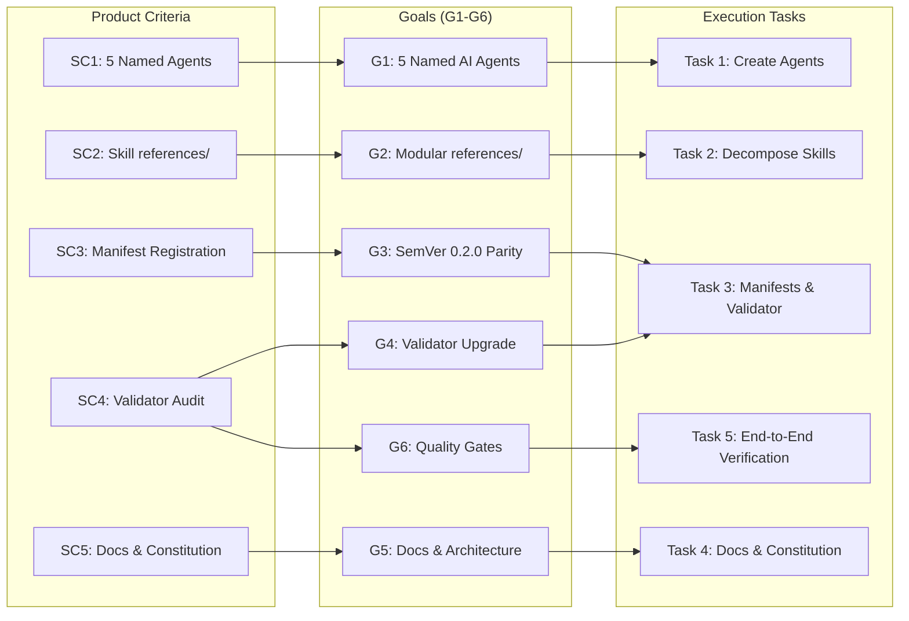

# Goals - Clube Modular Architecture

This document defines the discrete, verifiable engineering goals for the **Clube Modular Architecture Restructuring (v0.2.0)** milestone. All goals are derived directly from the Product Brainstorm (`SC1`–`SC5`) and Code Brainstorm (`CC1`–`CC4`).

---

## 1. Goals Summary Matrix

| ID | Kind | Goal Statement | Source IDs | Done When | Evidence | Owner Task | Async OK |
| :--- | :--- | :--- | :--- | :--- | :--- | :--- | :--- |
| **G1** | Functional | Create 5 named specialist AI agents with valid YAML frontmatter and domain instructions in `plugins/clube/agents/`. | `SC1`, `CC1` | 5 markdown files exist in `plugins/clube/agents/` with valid `name`, `description`, `tools`, `model`, and `readonly` properties. | `test -f plugins/clube/agents/expert-seo.md && test -f plugins/clube/agents/expert-tracking.md && test -f plugins/clube/agents/expert-privacy.md && test -f plugins/clube/agents/expert-performance.md && test -f plugins/clube/agents/clube-auditor.md` | Task 1 | `true` |
| **G2** | Architectural | Decompose all 4 vertical SaaS skills into lean `<100` line routing entrypoints and modular `references/` subdirectories. | `SC2`, `CC2` | Subdirectories `references/` exist in all 4 SaaS skills with extracted schemas, DDLs, and guides; `SKILL.md` files link to them. | `test -d plugins/clube/skills/saas-seo-geo/references && test -d plugins/clube/skills/marketing-attribution-analytics/references && test -d plugins/clube/skills/fullstack-performance-resilience/references && test -d plugins/clube/skills/data-privacy-observability/references` | Task 2 | `true` |
| **G3** | Release | Synchronize version `0.2.0` across all 9 manifests and register `agents` directory pointers. | `SC3`, `CC3` | All 9 manifest files declare `"version": "0.2.0"` and plugin manifests point to `"agents": "./agents/"`. | `bin/clube-config check` verifies 9/9 manifests aligned at v0.2.0 | Task 3 | `false` |
| **G4** | Quality | Upgrade `bin/clube-config check` engine to audit agents frontmatter, skill references, and SemVer 0.2.0 parity. | `SC4`, `CC4` | `bin/clube-config check` statically audits the 5 agent files, modular references directories, and SemVer parity with structured output. | `./bin/clube-config check` passes with 0 errors and displays agent audit counts | Task 3 | `false` |
| **G5** | Governance | Update architecture constitution, slash help, and bilingual documentation (EN / PT-BR) to document v0.2.0 modular architecture. | `SC5` | `clube-architecture/SKILL.md`, `help.md`, `README.md`, `README.pt-BR.md`, `CHANGELOG.md`, and `CHANGELOG.pt-BR.md` reflect agents and references. | `grep -q "expert-seo" plugins/clube/commands/help.md && grep -q "0.2.0" CHANGELOG.md && grep -q "0.2.0" CHANGELOG.pt-BR.md` | Task 4 | `false` |
| **G6** | Verification | Execute complete quality gates (`make check` and `make audit`) with 100% compliance and zero regressions. | `SC4`, `CC4`, Invariants | `make check` and `make audit` pass with exit code 0 and zero broken links or invalid configurations. | `make check && make audit` | Task 5 | `false` |

---

## 2. Detailed Goal Specifications

### Goal G1: Named Specialist AI Agents
- **ID:** `G1`
- **Kind:** `functional`
- **Statement:** Create 5 named specialist AI agents (`expert-seo`, `expert-tracking`, `expert-privacy`, `expert-performance`, `clube-auditor`) inside `plugins/clube/agents/` equipped with standardized YAML frontmatter (`name`, `description`, `tools`, `model`, `readonly`) and actionable domain instructions.
- **Source Criteria:** `SC1` (Product), `CC1` (Code)
- **Done When:**
  1. `plugins/clube/agents/expert-seo.md` exists and defines SEO/GEO, schema generation, and `/llms.txt` instructions.
  2. `plugins/clube/agents/expert-tracking.md` exists and defines Meta CAPI, first-touch cookie hygiene, and database attribution persistence.
  3. `plugins/clube/agents/expert-privacy.md` exists and defines LGPD/GDPR compliance, PII masking, and Sentry scrubbing instructions.
  4. `plugins/clube/agents/expert-performance.md` exists and defines SPA chunk recovery, edge cache headers, and database indexing instructions.
  5. `plugins/clube/agents/clube-auditor.md` exists and defines 360-degree audit orchestration and 4-phase remediation reporting.
- **Evidence:** `test -f plugins/clube/agents/expert-seo.md && test -f plugins/clube/agents/expert-tracking.md && test -f plugins/clube/agents/expert-privacy.md && test -f plugins/clube/agents/expert-performance.md && test -f plugins/clube/agents/clube-auditor.md`
- **Owner Task:** `Task 1`
- **Async OK:** `true` (Independent subagent execution in Wave 1)

---

### Goal G2: Modular Skill Decomposition into `references/`
- **ID:** `G2`
- **Kind:** `architectural`
- **Statement:** Decompose all 4 vertical SaaS skills into lean `<100` line routing entrypoints (`SKILL.md`) and modular `references/` subdirectories containing deep-dive schemas, DDLs, regex patterns, and framework integration guides.
- **Source Criteria:** `SC2` (Product), `CC2` (Code)
- **Done When:**
  1. `plugins/clube/skills/saas-seo-geo/references/` contains `meta-social.md`, `json-ld-schemas.md`, `geo-llmstxt.md`, and `crawling-sitemaps.md`.
  2. `plugins/clube/skills/marketing-attribution-analytics/references/` contains `first-touch-cookies.md`, `deduplication-hygiene.md`, `server-side-capi.md`, and `database-attribution.md`.
  3. `plugins/clube/skills/fullstack-performance-resilience/references/` contains `chunk-recovery.md`, `caching-edge-headers.md`, `runtime-tuning.md`, and `db-indexing-queries.md`.
  4. `plugins/clube/skills/data-privacy-observability/references/` contains `pii-masking-shape.md`, `sentry-observability-scrubbing.md`, and `compliance-retention.md`.
  5. All 4 `SKILL.md` files are streamlined under 100 lines and link to their respective `references/*.md` files.
- **Evidence:** `test -d plugins/clube/skills/saas-seo-geo/references && test -d plugins/clube/skills/marketing-attribution-analytics/references && test -d plugins/clube/skills/fullstack-performance-resilience/references && test -d plugins/clube/skills/data-privacy-observability/references`
- **Owner Task:** `Task 2`
- **Async OK:** `true` (Independent subagent execution in Wave 1)

---

### Goal G3: Manifest Registration & SemVer 0.2.0 Parity
- **ID:** `G3`
- **Kind:** `release`
- **Statement:** Synchronize version `0.2.0` across all 9 repository and plugin manifest files, and explicitly register the `agents` directory in all host plugin manifests.
- **Source Criteria:** `SC3` (Product), `CC3` (Code)
- **Done When:**
  1. `package.json` declares `"version": "0.2.0"`.
  2. `.claude-plugin/marketplace.json`, `.omp-plugin/marketplace.json`, `.cursor-plugin/marketplace.json`, `.agents/plugins/marketplace.json` declare version `0.2.0`.
  3. `plugins/clube/.claude-plugin/plugin.json`, `plugins/clube/.cursor-plugin/plugin.json`, `plugins/clube/.codex-plugin/plugin.json`, `plugins/clube/.omp-plugin/plugin.json` declare version `0.2.0` and point to `"agents": "./agents/"`.
- **Evidence:** `bin/clube-config check` validates 9/9 manifests matching `0.2.0`.
- **Owner Task:** `Task 3`
- **Async OK:** `false` (Requires Tasks 1 and 2 to be completed)

---

### Goal G4: Validator Engine Upgrade in `bin/clube-config`
- **ID:** `G4`
- **Kind:** `quality`
- **Statement:** Upgrade `bin/clube-config check` to audit agent definitions, frontmatter schema validity, skill `references/` directories, and SemVer 0.2.0 parity.
- **Source Criteria:** `SC4` (Product), `CC4` (Code)
- **Done When:**
  1. `cmd_check` in `bin/clube-config` inspects `plugins/clube/agents/*.md`, validating YAML frontmatter keys (`name`, `description`, `tools`, `model`, `readonly`).
  2. `cmd_check` verifies that all 4 SaaS skills have populated `references/` subdirectories.
  3. `cmd_check` audits 0.2.0 SemVer alignment across all 9 manifest files using Python 3 stdlib.
- **Evidence:** `./bin/clube-config check` executes cleanly, displays valid agent count, and reports 0 errors.
- **Owner Task:** `Task 3`
- **Async OK:** `false` (Executed concurrently with manifest bump in Task 3)

---

### Goal G5: Architecture Constitution & Bilingual Documentation Update
- **ID:** `G5`
- **Kind:** `governance`
- **Statement:** Update `clube-architecture/SKILL.md` (adding the agent standards and progressive disclosure references pattern), `plugins/clube/commands/help.md`, and the bilingual documentation mirror (`README.md`, `README.pt-BR.md`, `CHANGELOG.md`, `CHANGELOG.pt-BR.md`) to reflect v0.2.0 modular architecture.
- **Source Criteria:** `SC5` (Product)
- **Done When:**
  1. `clube-architecture/SKILL.md` defines Pillar 1 agent standards and progressive disclosure references architecture.
  2. `plugins/clube/commands/help.md` lists the 5 new specialist agents and updated modular skills.
  3. `README.md` and `README.pt-BR.md` document agents, references layout, and v0.2.0 features.
  4. `CHANGELOG.md` and `CHANGELOG.pt-BR.md` record the v0.2.0 release in Keep a Changelog format.
- **Evidence:** `grep -q "expert-seo" plugins/clube/commands/help.md && grep -q "0.2.0" CHANGELOG.md && grep -q "0.2.0" CHANGELOG.pt-BR.md`
- **Owner Task:** `Task 4`
- **Async OK:** `false` (Depends on completion of Tasks 1, 2, and 3)

---

### Goal G6: End-to-End Quality Gates & System Verification
- **ID:** `G6`
- **Kind:** `verification`
- **Statement:** Validate complete workspace integrity through `make check` and `make audit`, ensuring 100% compliance with zero regressions across slash commands, scripts, and multi-harness pointers.
- **Source Criteria:** `SC4` (Product), `CC4` (Code), Invariants
- **Done When:**
  1. `make check` executes with exit code 0 and reports 0 warnings/errors.
  2. `make audit` executes the full 360° Python audit suite and writes valid `.clube/audit-last.json`.
  3. All slash commands remain functional and linked to deterministic detector scripts.
- **Evidence:** `make check && make audit` outputting 0 errors.
- **Owner Task:** `Task 5`
- **Async OK:** `false` (Final verification wave)

---

## 3. Requirements Traceability Matrix

| Source Criterion | Mapped Goal(s) | Primary Owner Task | Verification Method |
| :--- | :--- | :--- | :--- |
| **SC1** (Product: 5 Named Agents) | **G1** | Task 1 | `test -f plugins/clube/agents/*.md` & `bin/clube-config check` |
| **SC2** (Product: Skill References) | **G2** | Task 2 | `test -d plugins/clube/skills/*/references` & `bin/clube-config check` |
| **SC3** (Product: Manifest Registration)| **G3** | Task 3 | JSON parsing across all 9 manifests |
| **SC4** (Product: Validator Audit) | **G4**, **G6** | Task 3, Task 5 | `make check` & `make audit` |
| **SC5** (Product: Docs & Constitution)| **G5** | Task 4 | `grep` validation across bilingual README/CHANGELOG |
| **CC1** (Code: 5 Agent Markdown Files)| **G1** | Task 1 | Frontmatter inspection & presence checks |
| **CC2** (Code: Decomposed References) | **G2** | Task 2 | Directory inspection & link validation |
| **CC3** (Code: SemVer 0.2.0 Alignment) | **G3** | Task 3 | `./bin/clube-config check` |
| **CC4** (Code: Check & Audit Suite) | **G4**, **G6** | Task 3, Task 5 | `make check && make audit` |
