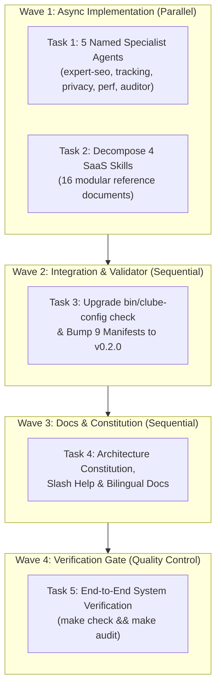

# Plan - Clube Modular Architecture

## 1. Executive Summary

The **Clube Modular Architecture Restructuring (v0.2.0)** transitions the Clube Marketplace into a fully modular multi-agent platform. This execution plan defines the concurrency model, wave barriers, verification gates, and dependency topology to ensure safe, deterministic delivery without breaking existing workflows.

---

## 2. Concurrency Model & Execution Waves



### 2.1 Wave Breakdown

| Wave | Concurrency | Tasks Included | Wave Barrier & Prerequisites |
| :--- | :--- | :--- | :--- |
| **Wave 1: Async Implementation** | **Parallel** (`async: true`) | **Task 1** (Agents) & **Task 2** (Skills Decomposition) | Dispatched concurrently to dedicated subagents. Both tasks modify disjoint filesystem trees (`plugins/clube/agents/` vs `plugins/clube/skills/`). |
| **Wave 2: Manifests & Validator** | **Sequential** (`async: false`) | **Task 3** (Validator Upgrade & Manifest Bump) | **Barrier:** Awaits completion of Wave 1 (T1 + T2). Updates `bin/clube-config` and all 9 manifests to validate new agents and references. |
| **Wave 3: Docs & Constitution** | **Sequential** (`async: false`) | **Task 4** (Docs & Constitution) | **Barrier:** Awaits completion of Wave 2 (T3). Updates `clube-architecture/SKILL.md`, `help.md`, `README*`, and `CHANGELOG*`. |
| **Wave 4: Verification Gate** | **Sequential** (`async: false`) | **Task 5** (Quality Gates) | **Barrier:** Awaits completion of Wave 3 (T4). Executes complete deterministic validation suite (`make check && make audit`). |

---

## 3. Dependency & Execution Graph

```
[Wave 1: Start]
   ├── Subagent A ──> Task 1: Create 5 Named Agents in plugins/clube/agents/
   └── Subagent B ──> Task 2: Decompose 4 SaaS Skills into references/
         │
         ▼ (Wave 1 Barrier: T1 + T2 Complete)
[Wave 2]
   └── Task 3: Upgrade bin/clube-config check & Bump 9 Manifests to 0.2.0
         │
         ▼ (Wave 2 Barrier: T3 Complete)
[Wave 3]
   └── Task 4: Update Architecture Constitution, Slash Help & Bilingual Docs
         │
         ▼ (Wave 3 Barrier: T4 Complete)
[Wave 4]
   └── Task 5: Execute make check && make audit (Zero-Token Quality Gate)
[Complete]
```

---

## 4. Traceability Matrix

| Goal ID | Goal Title | Mapped Task | Target Files | Verification Gate |
| :--- | :--- | :--- | :--- | :--- |
| **G1** | 5 Named Specialist AI Agents | **Task 1** | `plugins/clube/agents/*.md` | `test -f plugins/clube/agents/*.md` & `bin/clube-config check` |
| **G2** | Modular Skills Decomposition | **Task 2** | `plugins/clube/skills/*/` | `test -d plugins/clube/skills/*/references` |
| **G3** | SemVer 0.2.0 Manifest Parity | **Task 3** | `package.json`, 8 manifest JSONs | `bin/clube-config check` (9/9 aligned) |
| **G4** | Validator Engine Upgrade | **Task 3** | `bin/clube-config` | `./bin/clube-config check` returns 0 errors |
| **G5** | Docs & Constitution Sync | **Task 4** | `SKILL.md`, `help.md`, `README*`, `CHANGELOG*` | `grep` validation across docs |
| **G6** | Quality Gates & Verification | **Task 5** | Workspace Root | `make check && make audit` |

---

## 5. Verification Gates & Quality Criteria

### 5.1 Gate 1: Agent & References Structure Check
- **Command:** `test -f plugins/clube/agents/expert-seo.md && test -f plugins/clube/agents/expert-tracking.md && test -f plugins/clube/agents/expert-privacy.md && test -f plugins/clube/agents/expert-performance.md && test -f plugins/clube/agents/clube-auditor.md`
- **Criteria:** All 5 agent markdown files must exist with valid YAML frontmatter specifying `name`, `description`, `tools`, `model`, and `readonly`.
- **References Check:** All 4 SaaS skills must have a `references/` directory containing at least 3 `.md` files.

### 5.2 Gate 2: SemVer 0.2.0 Parity Check
- **Command:** `./bin/clube-config check`
- **Criteria:** Must confirm `SemVer parity: all manifests aligned at v0.2.0 (9/9 aligned)` with zero missing files or version mismatches.

### 5.3 Gate 3: Deterministic Python Audit Suite
- **Command:** `make audit`
- **Criteria:** Executes `audit-all.py` (which runs `audit-privacy.py`, `audit-performance.py`, `audit-seo.py`, `audit-tracking.py`), renders colored ASCII cards, and writes valid `.clube/audit-last.json`.

### 5.4 Gate 4: Bilingual Documentation Parity
- **Command:** `git diff --stat` & link checking
- **Criteria:** Documentation changes in `README.md` and `CHANGELOG.md` must have 100% mirrored parity in `README.pt-BR.md` and `CHANGELOG.pt-BR.md`.

---

## 6. Risk Management & Contingency Strategy

| Risk | Impact | Likelihood | Mitigation Strategy |
| :--- | :--- | :--- | :--- |
| **YAML frontmatter parsing errors in strict harnesses** | Broken subagent routing in Claude Code / OMP | Low | Validate frontmatter structure with regex in `bin/clube-config check` during CI / `make check`. |
| **Broken relative links in Markdown references** | Broken skill navigation for developers | Low | Use standard relative path links (`references/<file>.md` and `../SKILL.md`) verified during review. |
| **Manifest version drift** | Inconsistent marketplace releases | Low | Automated 9-manifest parity check in `bin/clube-config check` fails build on any mismatch. |
| **Regression in existing slash commands or audit scripts** | Broken developer workflow | Low | Full execution of `make audit` and slash command smoke testing before merge. |
