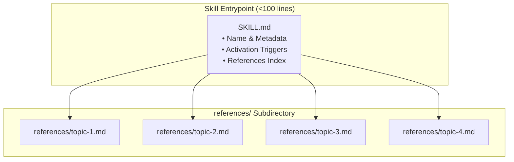

# Spec - Clube Modular Architecture

## 1. Overview & Architectural Philosophy

The **Clube Modular Architecture Restructuring (v0.2.0)** transforms the Clube AI Marketplace from monolithic skill files and unpopulated agent directories into a high-performance, modular system. It establishes:
1. **5 First-Class Named Specialist Agents** in `plugins/clube/agents/` with abstract capability routing and explicit tool constraints.
2. **Progressive Disclosure Skill Architecture**, refactoring the 4 dense SaaS skills into lean routing entrypoints (`SKILL.md` < 100 lines) supported by 16 focused `references/*.md` deep-dive guides.
3. **Automated Agent & References Audit** in `bin/clube-config check`, maintaining deterministic zero-dependency validation in pure Python 3 stdlib.
4. **SemVer 0.2.0 Minor Bump** synchronized across all 9 marketplace and plugin manifests.
5. **Architectural Constitution and Bilingual Documentation Parity** across English and Brazilian Portuguese.

---

## 2. Named Specialist AI Agents Specification (`plugins/clube/agents/`)

Each agent definition resides in `plugins/clube/agents/<name>.md` and adheres to the multi-harness frontmatter contract:

```yaml
---
name: <agent-name>
description: <concise-trigger-and-scope>
tools:
  - read
  - grep
  - glob
  - bash
  - write
model: reasoning | code
readonly: false | true
---
```

### 2.1 `expert-seo.md` (Technical SEO & GEO Specialist)
- **Goal Mapping:** `G1` (Source: `SC1`, `CC1`)
- **Location:** `plugins/clube/agents/expert-seo.md`
- **Frontmatter Configuration:**
  - `name`: `expert-seo`
  - `description`: "Specialist agent in technical SEO, Generative Engine Optimization (GEO), Schema.org JSON-LD, /llms.txt discovery, OpenGraph tags, and indexing boundaries."
  - `tools`: `[read, grep, glob, bash, write]`
  - `model`: `reasoning`
  - `readonly`: `false`
- **Core Domain Instructions:**
  - **Indexing Boundaries:** Enforce strict separation between public Landing Pages (`Allow: /`, canonical tags) and authenticated web apps (`<meta name="robots" content="noindex, nofollow" />` + `X-Robots-Tag: noindex, nofollow` HTTP headers). Prohibit canonical tags on `noindex` pages.
  - **Structured Data:** Generate valid Schema.org JSON-LD templates (`SoftwareApplication`, `FAQPage`, `Organization`, `BreadcrumbList`) with zero syntax errors.
  - **Generative Engine Optimization (GEO):** Author and validate `/llms.txt` and `/llms-full.txt` manifests conforming to the llmstxt.org specification to ensure AI engine citation (Perplexity, ChatGPT Search, Claude).
  - **Social Sharing Hygiene:** Validate absolute URLs in `og:image`, `og:url`, `twitter:card`, and verify presence of high-resolution preview images (`1200x630px`).
  - **Crawling & Sitemaps:** Generate clean `robots.txt` rules and dynamic XML sitemap generation scripts.

---

### 2.2 `expert-tracking.md` (Marketing Attribution & Analytics Specialist)
- **Goal Mapping:** `G1` (Source: `SC1`, `CC1`)
- **Location:** `plugins/clube/agents/expert-tracking.md`
- **Frontmatter Configuration:**
  - `name`: `expert-tracking`
  - `description`: "Specialist agent in marketing attribution, Meta Pixel & Conversions API (CAPI), GA4, root-domain cookie hygiene, and database acquisition persistence."
  - `tools`: `[read, grep, glob, bash, write]`
  - `model`: `code`
  - `readonly`: `false`
- **Core Domain Instructions:**
  - **Root-Domain First-Party Cookies:** Enforce storing UTM parameters (`utm_source`, `utm_medium`, `utm_campaign`, `utm_term`, `utm_content`), click IDs (`fbclid`, `gclid`, `ttclid`), and referrer information in first-party cookies with root domain scoping (`domain=.domain.com`) and 30-day TTL.
  - **Meta CAPI & Server-Side Tracking:** Implement server-side Conversions API alongside browser-side Meta Pixel with mandatory `event_id` deduplication pairing.
  - **Database Persistence (`acquisition_context`):** Store complete attribution payloads as JSONB in relational databases (PostgreSQL/MySQL) upon lead capture, checkout, and user registration.
  - **Payload Normalization & Hashing:** SHA-256 hash user data (`em`, `ph`, `fn`, `ln`, `external_id`) before transmitting to marketing APIs.

---

### 2.3 `expert-privacy.md` (Data Privacy, Observability & PII Specialist)
- **Goal Mapping:** `G1` (Source: `SC1`, `CC1`)
- **Location:** `plugins/clube/agents/expert-privacy.md`
- **Frontmatter Configuration:**
  - `name`: `expert-privacy`
  - `description`: "Specialist agent in LGPD/GDPR compliance, PII masking, shape logging, Sentry scrubbing, telemetry hygiene, and read-only audit logging."
  - `tools`: `[read, grep, glob, bash, write]`
  - `model`: `reasoning`
  - `readonly`: `false`
- **Core Domain Instructions:**
  - **Shape Logging Paradigm:** Enforce "Log the shape, not the data" across all loggers (Zap, Winston, Loguru, Pino, Slog). Prohibit blind serialization of structs, models, and request bodies (`%+v`, `zap.Any`, `console.log(user)`).
  - **PII Redaction Engine:** Provide deterministic masking helpers for CPF, email addresses, phone numbers, passwords, JWTs, and credit card numbers.
  - **Sentry & APM Data Scrubbing:** Implement `beforeSend` hooks and SDK integrations that strip `Authorization`, `Cookie`, `Set-Cookie`, and sensitive request parameters before transmission.
  - **Compliance & Retention:** Enforce retention policies, anonymization workflows, and read-only impersonation audit logging for administrative actions.

---

### 2.4 `expert-performance.md` (Fullstack Performance & Resilience Specialist)
- **Goal Mapping:** `G1` (Source: `SC1`, `CC1`)
- **Location:** `plugins/clube/agents/expert-performance.md`
- **Frontmatter Configuration:**
  - `name`: `expert-performance`
  - `description`: "Specialist agent in fullstack performance, SPA chunk recovery, CDN edge caching headers, container cgroups runtime tuning, and database query optimization."
  - `tools`: `[read, grep, glob, bash, write]`
  - `model`: `code`
  - `readonly`: `false`
- **Core Domain Instructions:**
  - **SPA Chunk Recovery:** Implement bulletproof dynamic import error handlers (`vite:preloadError`, `router.onError`) with `sessionStorage` reload-loop defense to eliminate white-screen 404 errors during zero-downtime deployments.
  - **Edge Caching Headers:** Enforce `Cache-Control: public, max-age=31536000, immutable` for hashed static assets, and `no-cache, no-store, must-revalidate` for dynamic HTML entrypoints.
  - **Container & Runtime Tuning:** Configure Go `automaxprocs`, Node/Bun event loop sizing, Python async worker concurrency, and memory bounds in containerized environments.
  - **Database Query Tuning:** Analyze `EXPLAIN (ANALYZE, BUFFERS)` execution plans, eliminate N+1 query patterns, design composite B-Tree indexes, and tune connection pool limits.

---

### 2.5 `clube-auditor.md` (360-Degree Production Readiness Coordinator)
- **Goal Mapping:** `G1` (Source: `SC1`, `CC1`)
- **Location:** `plugins/clube/agents/clube-auditor.md`
- **Frontmatter Configuration:**
  - `name`: `clube-auditor`
  - `description`: "360-degree audit coordinator agent executing deterministic Python detectors, parsing .clube/audit-last.json, and synthesizing 4-phase remediation reports."
  - `tools`: `[read, grep, glob, bash]`
  - `model`: `reasoning`
  - `readonly`: `true`
- **Core Domain Instructions:**
  - **Audit Execution:** Execute `plugins/clube/scripts/audit-all.py` or domain-specific scripts (`audit-seo.py`, `audit-tracking.py`, `audit-performance.py`, `audit-privacy.py`).
  - **Runlog Parsing:** Read structured facts, severities, and locations from `.clube/audit-last.json` without regex scraping stdout.
  - **Findings Prioritization:** Order issues by impact (`CRITICAL` > `HIGH` > `MEDIUM` > `LOW` > `INFO`).
  - **4-Phase Output Delivery:** Format final report following `### 1. Plan`, `### 2. Execution`, `### 3. Summary`, `### 4. Recommended Actions`.

---

## 3. SaaS Skills Decomposition Specification (`references/`)

All 4 vertical SaaS skills are restructured under the **Progressive Disclosure Principle**:
1. `SKILL.md` remains lean (< 100 lines), containing skill metadata, description, activation triggers, and direct references to topic guides.
2. `references/*.md` files contain deep technical guides, complete schemas, DDLs, regexes, and multi-framework implementations.



### 3.1 Skill: `saas-seo-geo`
- **Goal Mapping:** `G2` (Source: `SC2`, `CC2`)
- **Files to Produce:**
  - `plugins/clube/skills/saas-seo-geo/SKILL.md` (Lean trigger & routing entrypoint)
  - `plugins/clube/skills/saas-seo-geo/references/meta-social.md` (Open Graph, Twitter Cards, canonicals, favicon/PWA manifest)
  - `plugins/clube/skills/saas-seo-geo/references/json-ld-schemas.md` (SoftwareApplication, FAQPage, Organization, BreadcrumbList schemas)
  - `plugins/clube/skills/saas-seo-geo/references/geo-llmstxt.md` (Generative Engine Optimization, /llms.txt and /llms-full.txt format, AI crawler guidelines)
  - `plugins/clube/skills/saas-seo-geo/references/crawling-sitemaps.md` (robots.txt rules, dynamic XML sitemaps, SPA noindex headers, edge response rules)

---

### 3.2 Skill: `marketing-attribution-analytics`
- **Goal Mapping:** `G2` (Source: `SC2`, `CC2`)
- **Files to Produce:**
  - `plugins/clube/skills/marketing-attribution-analytics/SKILL.md` (Lean trigger & routing entrypoint)
  - `plugins/clube/skills/marketing-attribution-analytics/references/first-touch-cookies.md` (Root domain cookie scoping, 30-day persistence, fallback mechanisms)
  - `plugins/clube/skills/marketing-attribution-analytics/references/deduplication-hygiene.md` (Client-server `event_id` generation, payload normalization, collision avoidance)
  - `plugins/clube/skills/marketing-attribution-analytics/references/server-side-capi.md` (Meta Conversions API payload specification, GA4 Measurement Protocol, async queues)
  - `plugins/clube/skills/marketing-attribution-analytics/references/database-attribution.md` (acquisition_context JSONB schema, Postgres DDL, indexing, analytics queries)

---

### 3.3 Skill: `fullstack-performance-resilience`
- **Goal Mapping:** `G2` (Source: `SC2`, `CC2`)
- **Files to Produce:**
  - `plugins/clube/skills/fullstack-performance-resilience/SKILL.md` (Lean trigger & routing entrypoint)
  - `plugins/clube/skills/fullstack-performance-resilience/references/chunk-recovery.md` (Vite preload error trapping, reload-loop prevention, SW integration)
  - `plugins/clube/skills/fullstack-performance-resilience/references/caching-edge-headers.md` (Cache-Control directives, stale-while-revalidate, immutable assets, CDN config)
  - `plugins/clube/skills/fullstack-performance-resilience/references/runtime-tuning.md` (Node/Bun event loop, Python async worker sizing, Go automaxprocs, memory limits)
  - `plugins/clube/skills/fullstack-performance-resilience/references/db-indexing-queries.md` (Composite indexes, EXPLAIN ANALYZE, connection pooling, slow query elimination)

---

### 3.4 Skill: `data-privacy-observability`
- **Goal Mapping:** `G2` (Source: `SC2`, `CC2`)
- **Files to Produce:**
  - `plugins/clube/skills/data-privacy-observability/SKILL.md` (Lean trigger & routing entrypoint)
  - `plugins/clube/skills/data-privacy-observability/references/pii-masking-shape.md` (Shape logging paradigm, zero blind struct logging, CPF/email/phone redaction regexes)
  - `plugins/clube/skills/data-privacy-observability/references/sentry-observability-scrubbing.md` (Sentry beforeSend hooks, header stripping, OpenTelemetry attribute masking)
  - `plugins/clube/skills/data-privacy-observability/references/compliance-retention.md` (LGPD/GDPR compliance, data subject access/deletion, audit logging, retention policies)

---

## 4. Manifest Registration & Validator Engine Specification (`bin/clube-config check`)

### 4.1 Validator Engine Upgrade (`bin/clube-config`)
- **Goal Mapping:** `G4` (Source: `SC4`, `CC4`)
- **Requirements for `cmd_check`:**
  1. **Agent Auditing:** Check for the existence of `plugins/clube/agents/`. Inspect each `.md` file in the directory, verifying standard YAML frontmatter containing `name`, `description`, `tools`, `model`, and `readonly`.
  2. **Skills & References Auditing:** Inspect `plugins/clube/skills/*/` directories. Verify that vertical SaaS skills contain a non-empty `references/` subdirectory with valid `.md` topic files.
  3. **SemVer 0.2.0 Parity:** Verify that all 9 manifests declare version `0.2.0`.
  4. **Output Integrity:** Print clean ANSI status indicators and structured summary table.

### 4.2 9-Manifest Synchronization (`0.2.0`)
- **Goal Mapping:** `G3` (Source: `SC3`, `CC3`)
- **Target Files:**
  1. `package.json` -> `"version": "0.2.0"`
  2. `.claude-plugin/marketplace.json` -> `"version": "0.2.0"`
  3. `.omp-plugin/marketplace.json` -> `"version": "0.2.0"`
  4. `.cursor-plugin/marketplace.json` -> `"version": "0.2.0"`
  5. `.agents/plugins/marketplace.json` -> `"version": "0.2.0"`
  6. `plugins/clube/.claude-plugin/plugin.json` -> `"version": "0.2.0"`, `"agents": "./agents/"`
  7. `plugins/clube/.cursor-plugin/plugin.json` -> `"version": "0.2.0"`, `"agents": "./agents/"`
  8. `plugins/clube/.codex-plugin/plugin.json` -> `"version": "0.2.0"`, `"agents": "./agents/"`
  9. `plugins/clube/.omp-plugin/plugin.json` -> `"version": "0.2.0"`, `"agents": "./agents/"`

---

## 5. Architecture Constitution & Documentation Specification

- **Goal Mapping:** `G5` (Source: `SC5`)

### 5.1 `plugins/clube/skills/clube-architecture/SKILL.md`
- Update Pillar 1 to define:
  - Multi-Harness Agent Specification (frontmatter contract, capability classes, tool restrictions).
  - Progressive Disclosure Skill Layout (`SKILL.md` entrypoint + `references/` topic guides).

### 5.2 `plugins/clube/commands/help.md`
- Add **Available Specialist Agents** section listing the 5 agents (`expert-seo`, `expert-tracking`, `expert-privacy`, `expert-performance`, `clube-auditor`).
- Update **Available Skills** section describing the modular references layout.

### 5.3 Bilingual Documentation
- `README.md` (English) & `README.pt-BR.md` (Brazilian Portuguese):
  - Document the 5 specialist agents with example invocation instructions.
  - Document the modular `references/` directory layout.
  - Highlight v0.2.0 release features.
- `CHANGELOG.md` (English) & `CHANGELOG.pt-BR.md` (Portuguese):
  - Add release entry `[0.2.0] - 2026-09-13` adhering to Keep a Changelog.
  - Categorize changes under `Added`, `Changed`, and `Improved`.

---

## 6. Verification & Quality Gates Specification

- **Goal Mapping:** `G6` (Source: `SC4`, `CC4`, `Invariants`)
- **Deterministic Validation:**
  - `./bin/clube-config check` must pass with 0 errors and report 5 valid agents, modular references, and 9/9 manifests aligned at v0.2.0.
  - `make check` must execute cleanly without warnings.
  - `make audit` must execute the Python detector test suite and write `.clube/audit-last.json`.
  - All Markdown links across `SKILL.md` and `references/*.md` must resolve to valid relative paths.
