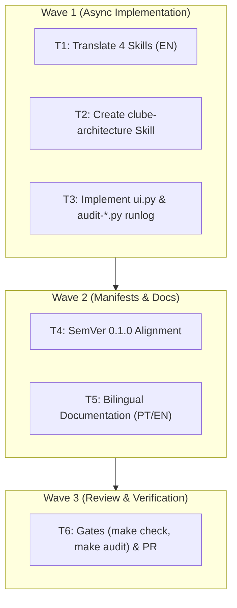

# Plan - Clube v0.1.0

## Execution Architecture

## Review & Security Strategy
- Code review performed via `review` subagent verifying contract adherence and SemVer parity.
- Security review performed via `expert-security` auditing file paths, scripts, and inputs for no command injections or unvetted privilege escalation.
- Zero-token verification gate: `make check` and `make audit` must pass 100%.
