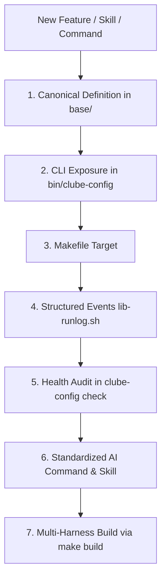

# Architecture & Engineering Discipline — Clube Marketplace

This document defines the **Development Constitution** of the `clube-marketplace` suite.
No new skill, agent, command, or script may be added in isolation. Every addition to the repository must follow the architectural principles and integration layers defined below.

---

## 1. The 7 Mandatory Pillars for Adding New Capabilities

When designing and implementing any new capability (skill, slash command, agent workflow, or utility script), the following checklist is **mandatory**:

### Pillar 1: Canonical Definition (`base/`)
- **Location:** All canonical sources reside exclusively in `base/`:
  - Skills in `base/skills/<name>/SKILL.md`
  - Commands in `base/commands/<name>.md`
  - Core scripts & libraries in `base/shared/`
- **Fault Tolerance:** Scripts must use `set -euo pipefail`, clean POSIX compatibility, and safe fallback handling.

### Pillar 2: CLI Exposure (`bin/clube-config`)
- Every runnable capability must be mapped to a subcommand in `bin/clube-config`.
- Subcommands must provide clear help documentation and clean CLI error handling.

### Pillar 3: Build & Automation (`Makefile`)
- Every top-level operation must have a target in `Makefile` and be listed in `make help`.
- The `make build` target executes `scripts/build-distribution.sh` to replicate canonical definitions to all harness directories.

### Pillar 4: Structured Events (`base/shared/lib-runlog.sh`)
- Scripts executing state changes or inspections should emit atomic structured log events via `runlog_event <status> <event_id> [details]`.

### Pillar 5: Health & Integrity Audit (`bin/clube-config check`)
- `clube-config check` (and `/check-status`) must audit:
  - Active host harness detection.
  - Presence and integrity of `AGENTS.md`.
  - Alignment of pointer files (`CLAUDE.md`, `GEMINI.md`, `.cursorrules`).
  - Compliance of skill/agent directory structures (`skills/<name>/SKILL.md`).

### Pillar 6: Standardized AI Skills & Commands
- **Frontmatter:** All skills must contain YAML frontmatter (`name:`, `description:`).
- **All in English:** Internal instructions, contracts, and code must remain in canonical English.
- **Interactive Prompts:** If non-standard formats or legacy files are detected, prompt the user:
  - `[1] Move to standard format (Recommended)`
  - `[2] Leave as is`
- **4-Phase Output Contract:** Every command and skill must adhere to:
  1. `### 1. Plan` (Command, Action, Reversible)
  2. `### 2. Execution` (`✅`, `⏭️`, `⚠️`, `❌`)
  3. `### 3. Summary` (Status table, Source of Truth, Changed, Revert steps)
  4. `### 4. Recommended Actions` (Mandatory if `⚠️` or `❌` occurs)

### Pillar 7: Multi-Harness Distribution (`scripts/build-distribution.sh`)
- Never edit distributed directories (`omp/`, `claude-code/`, `cursor/`, `antigravity/`, `opencode/`, root `skills/`, root `commands/`) manually.
- Always modify canonical files in `base/` and run `make build`.

---

## 2. The Inviolable Architectural Rules

1. **Single Source of Truth (`AGENTS.md`):**
   - In any target project, `AGENTS.md` is the only authoritative persistence file for AI configuration and instructions.
   - Sibling harness files (`CLAUDE.md`, `GEMINI.md`, `.cursorrules`) must strictly import `@AGENTS.md`.

2. **Standard Skill Layout:**
   - Skills must reside in directory-isolated format: `skills/<name>/SKILL.md`. Flat markdown files (e.g., `skills/my-skill.md`) are non-standard.

3. **No Silent Overwrites:**
   - Never overwrite or delete user configuration or custom instructions without explicit confirmation.

4. **Multi-Harness Parity:**
   - All skills and commands must work interchangeably across Oh My Pi, Claude Code, Cursor, Antigravity, and OpenCode.
