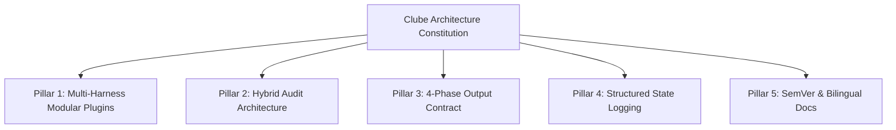
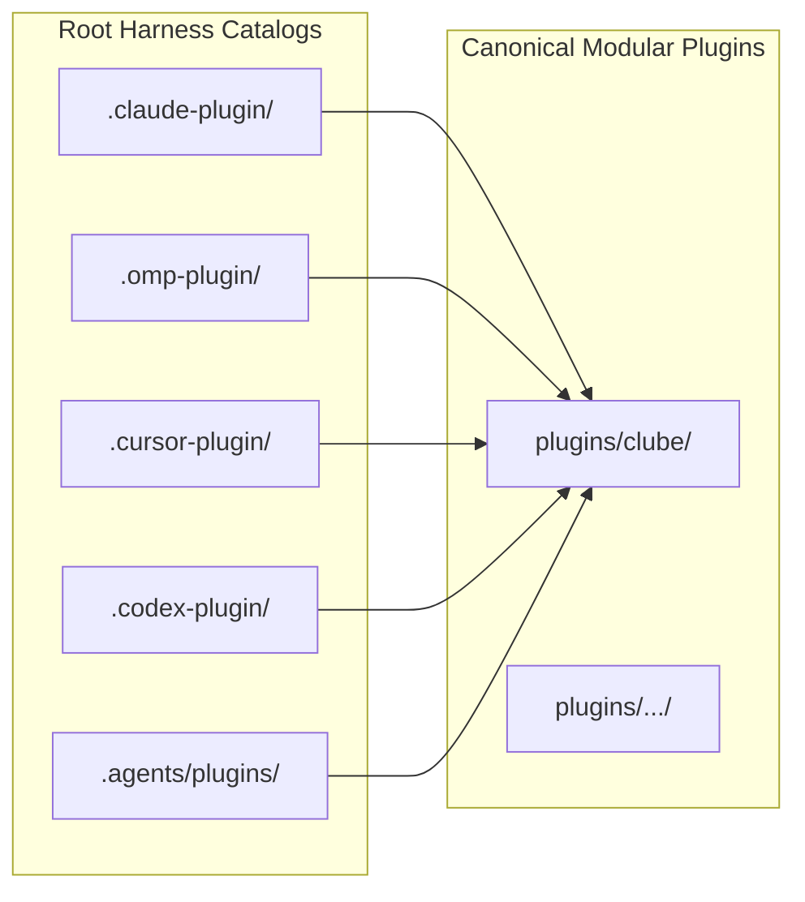
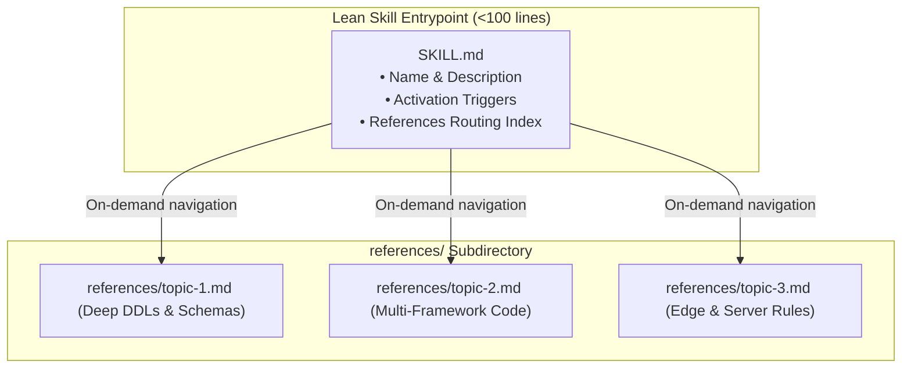
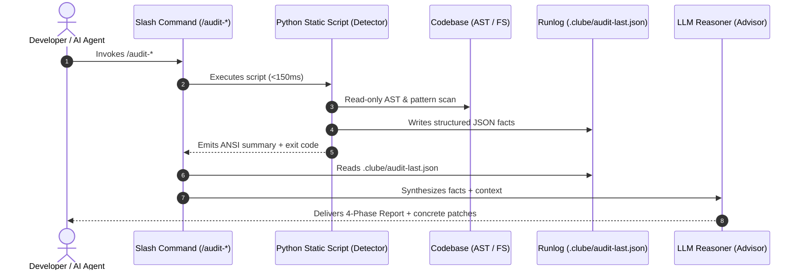
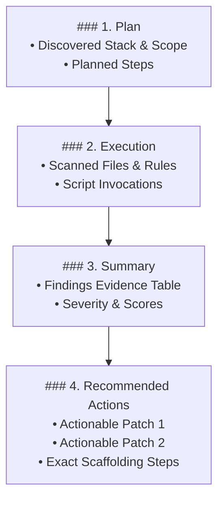
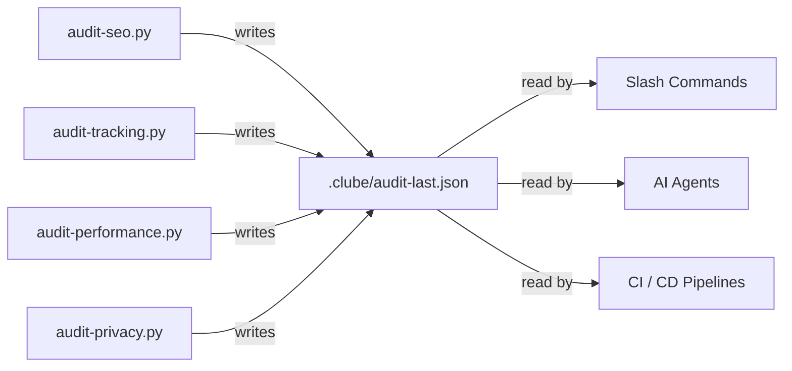
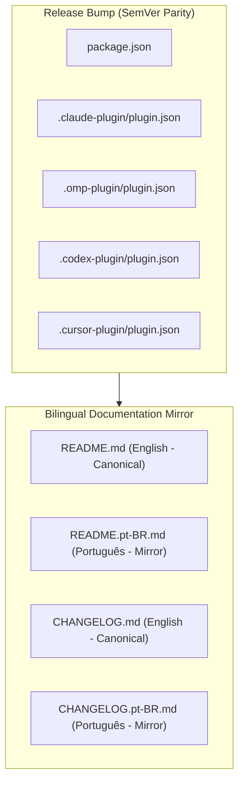

# Clube Architecture & Engineering Constitution

This document defines the **Architectural Constitution and Engineering Discipline** for the Clube AI Marketplace (`clube`). Every skill, command, script, plugin manifest, and AI workflow in this repository must strictly adhere to the **5 Mandatory Pillars**.



---

## Pillar 1: Multi-Harness Modular Plugin Standard

The Clube Marketplace adopts the **Expo/LoopTech Multi-Harness Pattern**, establishing unified distribution across heterogeneous AI coding environments (Claude Code, Cursor, Codex, Oh My Pi, Antigravity, OpenCode).



### 1.1 Architectural Rules
- **Single Source of Truth:** `AGENTS.md` is the authoritative instructions file for all AI harnesses. Root configuration files (`CLAUDE.md`, `GEMINI.md`, `.cursorrules`) must reference `@AGENTS.md` rather than duplicating instructions.
- **Canonical Plugin Isolation:** All business logic, skills, slash commands, agents, and scripts reside under `plugins/<plugin_name>/` (e.g., `plugins/clube/`).
- **Zero-Duplication Rule:** Harness root catalogs (`.claude-plugin/`, `.omp-plugin/`, `.cursor-plugin/`, `.codex-plugin/`) point directly to `plugins/clube/` manifests or symlinks. Physical copies of Markdown commands or skills across harness folders are strictly prohibited.
- **Catalog Verification:** Running `make check` or `./bin/clube-config check` validates all harness catalog pointers, manifest schemas, agent definitions, skill references, and plugin integrity across the workspace.

### 1.2 Named Specialist Agents Standard (`plugins/<plugin>/agents/`)

Clube adopts a **Named Specialist Agent Pattern** to delegate deep domain implementations to dedicated subagents while preventing context pollution.

#### Multi-Harness Frontmatter Contract
Every agent file under `plugins/<plugin>/agents/<name>.md` must define a strict YAML frontmatter header:

```yaml
---
name: expert-seo
description: Specialist agent in technical SEO, Generative Engine Optimization (GEO), Schema.org JSON-LD, /llms.txt discovery, OpenGraph tags, and indexing boundaries.
tools: Read, Write, Edit, Grep, Glob, Bash
model: inherit
readonly: false
---
```

#### Abstract Capability Classes
- **Zero Vendor Model Hardcoding:** Agent definitions must **never** hardcode specific vendor model identifiers (e.g., `claude-3-7-sonnet`, `gpt-4o`, `gemini-1.5-pro`).
- **Abstract Capability Tiers:** Agents declare abstract capability classes (`reasoning`, `code`, `critique`):
  - `reasoning`: High-reasoning model class for architectural planning, audits, complex synthesis, and root-cause analysis.
  - `code`: High-speed, high-precision model class for code edits, refactorings, and test generation.
  - `critique`: Read-only evaluation model class for code reviews and QA gates.
- The active host harness maps these abstract classes to physical models via `Project Profile` in `AGENTS.md` or harness config overrides (e.g., `/clube:omp-setup`).

#### Tool Scoping & Readonly Invariants
- Read-only coordinator agents (e.g., `clube-auditor`) declare `readonly: true` and omit modifying tools (`Write`, `Edit`).
- Implementation agents declare `readonly: false` and explicitly specify allowed toolsets.

### 1.3 Progressive Disclosure Skill Architecture (`references/`)

To maintain maximum token efficiency and fast context loading, skills follow the **Progressive Disclosure Principle**:



1. **Lean Entrypoint (`SKILL.md`):** Limited to `<100 lines`. Acts purely as an activation router containing domain triggers, behavioral rules, and a clear topic guide index.
2. **Modular References (`references/*.md`):** Deep-dive reference guides containing production DDLs, complete JSON schemas, regexes, and framework-specific implementations (React, Vue, Go, Python, Next.js, Vite). Agents load only the specific reference required for their active task.

---

## Pillar 2: Hybrid Audit Architecture (Detector + Advisor)

Clube audits decouple **deterministic fact collection** from **generative intelligent remediation**. This two-tier design guarantees maximum speed, reproducibility, and minimal token expenditure.



### 2.1 The Two Layers

| Layer | Component | Execution Profile | Responsibility |
| :--- | :--- | :--- | :--- |
| **Detector (Static)** | `plugins/clube/scripts/*.py` | `<150ms`, zero tokens, Python 3 stdlib | Read-only deterministic heuristics, AST scans, regex checks, exit codes, and JSON fact persistence. |
| **Advisor (LLM)** | `plugins/clube/commands/*.md` | Generative reasoning via active model | Evaluates context, eliminates false positives, recommends architecture changes, and generates complete code diffs. |

### 2.2 Detector Implementation Standards
- **Pure Python 3 Standard Library:** Scripts in `plugins/clube/scripts/` must **never** require external `pip` dependencies. They must execute immediately on any standard Linux/macOS/Windows developer workstation.
- **Strict Read-Only Execution:** Audit scripts never modify files, touch network endpoints, or execute untrusted code.
- **Dual Output Contract:** Detector scripts support both rich ANSI terminal output for humans and machine-readable `--json` output for automated tooling.

---

## Pillar 3: The 4-Phase Output Contract

Every AI slash command execution, audit report, and automated delivery in the Clube Marketplace must adhere to the standardized **4-Phase Output Contract**.



### 3.1 Mandatory Section Specifications

#### `### 1. Plan`
- Identifies the target codebase, detected frameworks (Next.js, FastAPI, Go, Vue, etc.), and execution scope.
- Outlines the exact steps the assistant will execute.

#### `### 2. Execution`
- Documents commands executed, paths analyzed, and heuristics evaluated.
- Shows transparent execution traces without polluting the output with raw file dumps.

#### `### 3. Summary`
- Presents an empirical findings table structured with standard headers:

| Category | Finding | Severity | File / Location | Status |
| :--- | :--- | :--- | :--- | :--- |
| **SEO** | Missing `/llms.txt` manifest | `HIGH` | `public/llms.txt` | `FAIL` |
| **Privacy** | Raw email logged in auth handler | `CRITICAL` | `src/auth/login.ts:42` | `FAIL` |
| **Performance**| Uncompressed WebP hero asset | `MEDIUM` | `assets/hero.png` | `WARN` |

#### `### 4. Recommended Actions`
- Provides concrete, prioritized, copy-paste-ready remediations or exact tool edit instructions.
- Includes full code snippets and scaffolding examples rather than vague suggestions.

---

## Pillar 4: Structured State Logging (Runlog)

To eliminate brittle terminal scraping, all audit scripts persist their findings into a structured state file: `.clube/audit-last.json`.



### 4.1 Canonical Runlog Schema

The shared UI and logging engine (`plugins/clube/scripts/ui.py`) writes structured runlog data adhering to this JSON schema:

```json
{
  "$schema": "http://json-schema.org/draft-07/schema#",
  "title": "ClubeAuditRunlog",
  "type": "object",
  "required": ["timestamp", "audit", "verdict", "score", "findings", "metadata"],
  "properties": {
    "timestamp": {
      "type": "string",
      "format": "date-time",
      "description": "ISO-8601 UTC timestamp of execution"
    },
    "audit": {
      "type": "string",
      "description": "Audit identifier: 'seo' | 'tracking' | 'performance' | 'privacy' | 'all'"
    },
    "verdict": {
      "type": "string",
      "enum": ["PASSED", "WARNING", "FAILED"]
    },
    "score": {
      "type": "integer",
      "minimum": 0,
      "maximum": 100
    },
    "findings": {
      "type": "array",
      "items": {
        "type": "object",
        "required": ["id", "category", "severity", "title", "description"],
        "properties": {
          "id": { "type": "string" },
          "category": { "type": "string" },
          "severity": { "type": "string", "enum": ["CRITICAL", "HIGH", "MEDIUM", "LOW", "INFO"] },
          "title": { "type": "string" },
          "description": { "type": "string" },
          "file": { "type": "string" },
          "line": { "type": "integer" },
          "recommendation": { "type": "string" }
        }
      }
    },
    "metadata": {
      "type": "object",
      "properties": {
        "duration_ms": { "type": "number" },
        "scanned_files": { "type": "integer" },
        "root_directory": { "type": "string" }
      }
    }
  }
}
```

### 4.2 Consumption Protocol
AI agents and slash commands must inspect `.clube/audit-last.json` to extract precise facts, line numbers, and severities, completely avoiding ANSI escape code stripping or stdout regex parsing.

---

## Pillar 5: Semantic Versioning & Bilingual Documentation

The Clube Marketplace maintains rigorous release hygiene through synchronized versioning and dual-language documentation parity.



### 5.1 SemVer Parity
- All release tags adhere strictly to Semantic Versioning (`vMAJOR.MINOR.PATCH`).
- Version numbers must be bumped synchronously across **all** harness manifests and `package.json`. No manifest may drift ahead or lag behind.

### 5.2 Bilingual Documentation Policy
- **English as Canonical Source:** All skills (`SKILL.md`), command definitions (`commands/*.md`), agent prompts (`agents/*.md`), code comments, and primary documentation (`README.md`, `CHANGELOG.md`) are authored in clear, technical, idiomatic English.
- **Brazilian Portuguese Synchronization:** Comprehensive developer documentation is mirrored in Brazilian Portuguese (`README.pt-BR.md`, `CHANGELOG.pt-BR.md`). When adding or altering features, documentation updates in both languages are mandatory before merge.

---

## 6. Architectural Anti-Patterns

| Anti-Pattern | Violation | Correct Practice |
| :--- | :--- | :--- |
| **Hardcoding vendor model slugs in agents** | Violates Pillar 1 (1.2) | Use abstract capability classes (`reasoning`, `code`, `critique`) mapped via Project Profile. |
| **Monolithic skill files exceeding 100 lines** | Violates Pillar 1 (1.3) | Keep `SKILL.md` entrypoint lean and split deep documentation into `references/*.md`. |
| **Direct bash AST scraping in commands** | Violates Pillar 2 | Call canonical Python detector scripts in `plugins/clube/scripts/`. |
| **External `pip` packages in scripts** | Violates Pillar 2 | Use only standard library modules (`sys`, `os`, `json`, `re`, `ast`, `urllib`). |
| **Ad-hoc or free-form audit outputs** | Violates Pillar 3 | Strictly use the `### 1. Plan` through `### 4. Recommended Actions` format. |
| **Parsing terminal ANSI stdout in LLMs** | Violates Pillar 4 | Read `.clube/audit-last.json` for deterministic structured facts. |
| **English-only or Portuguese-only PRs** | Violates Pillar 5 | Keep `README.md` and `README.pt-BR.md` in strict parity. |
| **Manifest version drift across harnesses** | Violates Pillar 5 | Verify version alignment across all harness `plugin.json` files with `make check`. |
